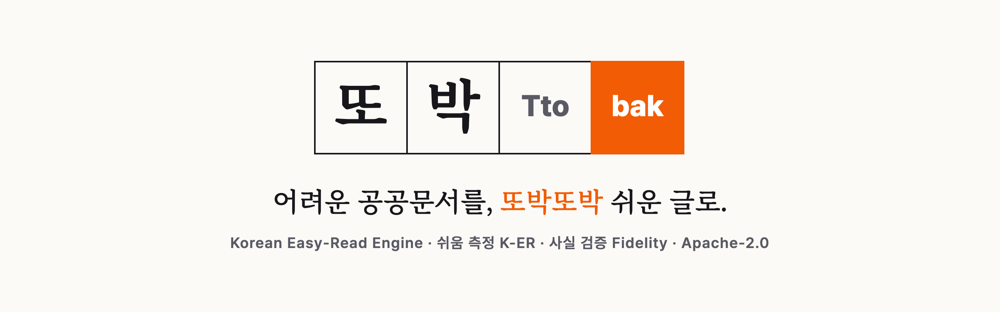
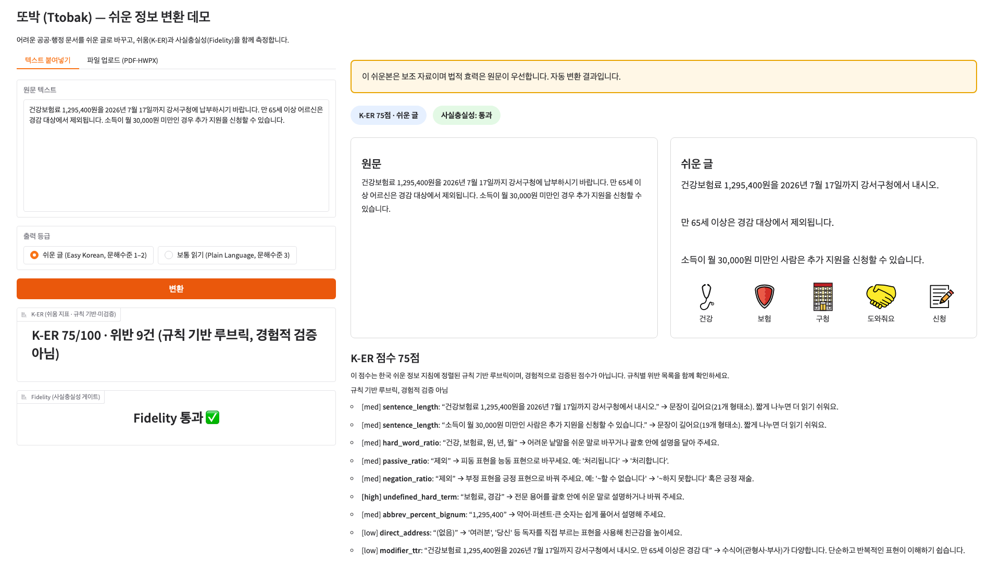

<p align="center">
  
</p>

<p align="center">
  <a href="https://github.com/needsbuilder/ttobak/actions/workflows/ci.yml"></a>
  
  
  
  
</p>

**또박(Ttobak)** 은 어려운 한국어 공공·행정 문서(공문·고지서·안내문)를 **쉬운
글(Easy-Read)** 로 바꾸는 오픈소스 엔진입니다. 쉬움을 **K-ER 점수로 측정**하고,
숫자·날짜·금액·기한·자격이 바뀌지 않았는지 **Fidelity 게이트로 검증**하며,
왜곡이 의심되면 고치지 않고 **사람 검수로 회부**합니다.

<p align="center">
  
  <br>
  <sub>실제 웹 데모 실행 화면 (합성 없음) — 원문·쉬운 글 나란히 + K-ER 75점 + Fidelity 통과 + 픽토그램</sub>
</p>

## 왜 또박인가

| | |
|---|---|
| 📏 **측정하는 쉬움** | 열두 가지 규칙(문장 길이·어려운 낱말·피동·부정 밀도 …)으로 K-ER 점수를 매기고, 점수보다 **규칙별 위반 체크리스트**를 핵심 산출물로 냅니다. |
| 🧷 **사실이 먼저** | Fidelity 게이트가 금액·날짜·자격을 슬롯별로 원문과 대조합니다. 값이 사라지면 자동 재교정, `미만→이하` 같은 **의미 반전은 자동 교정 없이 사람 검수로** 돌려보냅니다. |
| 📄 **포맷 네이티브** | 관공서 원본 포맷(PDF·HWPX)을 변환 없이 직접 파싱합니다. |
| 🔓 **전부 공개** | 코드(Apache-2.0)·코퍼스(CC BY 4.0)·평가 하네스까지 공개. 로컬 모델(큐원 2.5 7B, Apache-2.0)로도 동일하게 동작합니다. |

## 빠른 시작

```bash
python -m pip install -e ".[dev]"   # 설치 (Python 3.11+)
ttobak web --provider fake          # 웹 데모 (fake = API 키 불필요)
python -m pytest -q                 # 테스트 (384개)
```

Anthropic API 키가 있으면 `--provider anthropic`, 로컬 Ollama가 있으면
`--provider ollama`(기본 모델 `qwen2.5:7b`, Apache-2.0)로 실행합니다.

## 아키텍처 — 공개 함수 6개

```
parse()       텍스트·PDF·HWPX → IR Document
simplify()    GENERATE → MEASURE → REVISE 루프 (Fidelity 위반 시에만 재교정)
score()       K-ER 규칙 루브릭: 12규칙 평균 0–100 + 위반 체크리스트
verify()      슬롯 추출 → HIGH 슬롯 정확일치 검증 → 드리프트/부정 가드 → 판정
match()       픽토그램 렉시콘 룩업 (경로 참조만 — 글리프 비내장)
render_html() 원문/쉬운본 나란히 HTML + 면책 + 배지
```

웹 데모와 평가 하네스는 전부 이 코어의 얇은 래퍼입니다.

## 숫자로 보는 또박 (전부 실측·재현 가능)

- 공개 합성 코퍼스 11쌍: K-ER 평균 **71.2 → 80.7 (Δ +9.5)**, 규칙 위반 평균 −2.09건,
  **전 페어 Fidelity PASS** — 재현: `python -m tooling.annotate_corpus`
- 테스트 **384개** 통과 · 라이선스/보안 감사 clean (`ttobak audit`)
- CI 4중 게이트: pytest + 의존성 라이선스 허용목록 + 자산 분리 검사 + 감사

## 정직성 (Honesty) — 반드시 읽어 주세요

- K-ER 점수는 **한국 Easy-Read 지침에 정렬된 규칙 기반 루브릭**이며 **경험적으로
  검증된 지표가 아닙니다** (공개·검증된 한국어 Easy-Read 라벨 코퍼스 부재). 0–100
  점수는 보조 지표이고, 규칙별 위반 체크리스트(pass/fail)가 핵심 산출물입니다.
- 모든 출력은 원문과 면책 고지를 함께 렌더링합니다: **"자동 변환 결과이며 법적
  효력은 원문이 우선합니다."**
- 또박은 "한국어 Easy-Read AI 최초"를 주장하지 않습니다(온글·KCI·KIPS 선행). 엣지는
  **열림 + 측정 + 자가 교정 + 포맷 네이티브**입니다.
- 코퍼스는 현재 전부 합성 문서이며 사람 최종 검수가 남아 있습니다. 실문서(KOGL-1)
  보강과 100~300쌍 확장은 로드맵입니다.

## 라이선스 — 세 갈래 분리

| 대상 | 라이선스 | 위치 |
|---|---|---|
| 코드 | **Apache-2.0** | [`LICENSE`](LICENSE) |
| 코퍼스(데이터) | **CC BY 4.0** | [`corpus/`](corpus/) |
| 픽토그램 | **CC BY-SA** (Mulberry·OpenMoji, 세트별) | [`assets/`](assets/README.md) |

세 라이선스는 섞이지 않으며, CI가 분리를 강제합니다:

```bash
python scripts/check_licenses.py     # GPL/AGPL/NC 의존성 발견 시 실패
python -m tooling.check_licenses --root .   # = ttobak audit (자산 분리·시크릿 포함)
```

자세한 출처는 [`THIRD_PARTY_LICENSES.md`](THIRD_PARTY_LICENSES.md)와
[`NOTICE`](NOTICE)를 보세요.

<details>
<summary><b>MVP 스코프 (2026 오픈소스 개발자대회 출품)</b></summary>

1. 입력: 텍스트 + PDF + HWPX(best-effort) → IR. (이미지 OCR = 스트레치)
2. 파이프라인: GENERATE → MEASURE → REVISE (provider-agnostic LLM).
3. K-ER: 규칙 루브릭 → 0–100 + 위반 목록.
4. Fidelity 게이트: 숫자/날짜/금액/기한/자격/엔티티 추출·검증·롤백 (고-recall, fail-safe = '검수 필요').
5. 렌더러: 원문/쉬운본 나란히 HTML + 면책 + K-ER·Fidelity 배지 + 소형 픽토그램 룩업.
6. 표면: 파이썬 패키지 + 웹 데모. (MCP 서버 = 스트레치)

> Stretch (not MVP): 이미지 OCR, MCP 서버, K-ER 모델 레이어(KcBERT/RSRS),
> semantic-NLI fidelity, semantic 픽토그램 매칭, TTS, 배치.

</details>
